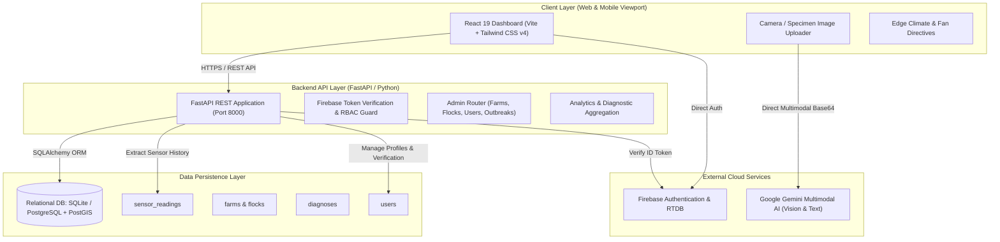
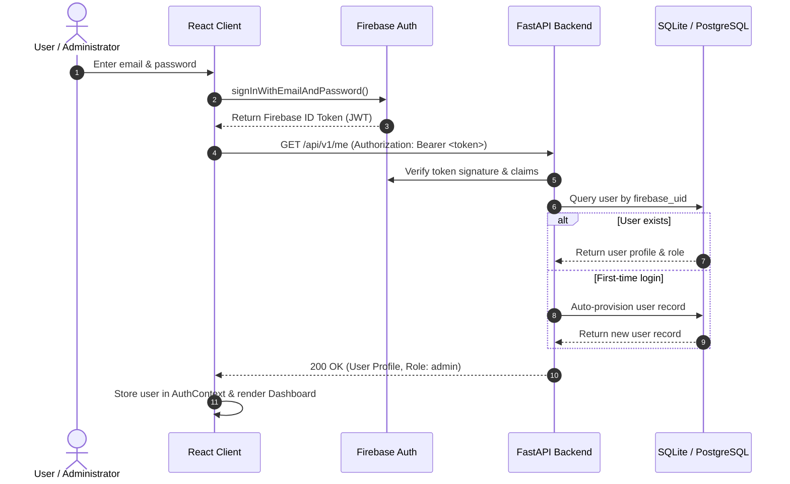
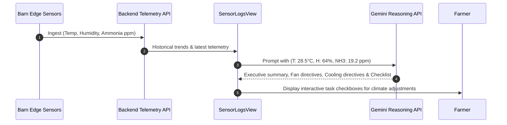

# PoultryGuard — System Architecture Documentation

## 1. Executive Summary

**PoultryGuard** is an enterprise-grade biosurveillance, environmental IoT, and artificial intelligence diagnostic platform engineered for commercial poultry farming and avian disease mitigation. The system unifies real-time edge telemetry (temperature, humidity, ammonia, smoke), geospatial flock tracking, veterinary verification workflows, and multimodal computer vision (powered by Google Gemini Vision) to detect high-consequence avian pathogens (e.g., Coccidiosis, Newcastle Disease, Avian Influenza) before wide-scale flock mortality occurs.



---

## 2. Core Architecture Tiers

### 2.1. Frontend Tier (Client Application)
* **Framework:** React 19 bootstrapped with Vite 8.
* **Styling & UI:** Tailwind CSS v4 using a specialized PoultryGuard theme:
  * Primary Dark Green: `#214E34` (Primary actions, topbars, active nav states)
  * Secondary Soft Sage Green: `#E1EDE6` (Card backgrounds, progress fills, badges)
  * Base White: `#FFFFFF` (Main page canvases, clean cards)
  * Typography: `#222222` (Headings and readable copy)
  * Subtext & Borders: `#666666` (Labels, helper text, input borders)
  * Alert Red: `#D9534F` (Medical disclaimers, critical thresholds, error alerts)
* **Micro-Interactions & Animations:** Tactile button/card press feedback (`transform: scale(0.97)`), route transitions (`.screen-enter`), laser scanner overlay for image analysis (`.laser-scanner`), and interactive task checklists.
* **Geospatial Visualization:** Leaflet GIS with interactive farm markers and radial infection outbreak buffers.
* **Data Visualization:** Recharts for historical 7-day/30-day sensor telemetry trends (temperature, humidity, ammonia).

### 2.2. Backend Tier (API Service)
* **Framework:** FastAPI (Python 3.11+) running with ASGI server Uvicorn.
* **CORS Policy:** Configured via `CORSMiddleware` supporting `http://localhost:5173`, `http://localhost:3000`, `http://127.0.0.1:5173`, and wildcard local development origins with full credentials, headers, and methods support.
* **Authentication & RBAC:** Firebase ID Token decoding with fallback decoding and SQLite/PostgreSQL synchronization; role enforcement (`admin`, `vet`, `farmer`).
* **Validation & Serialization:** Pydantic v2 schemas for all payloads with regex pattern matching and HTTP exception handling.

### 2.3. Data & Storage Tier
* **Primary Database:** SQLite (`poultryguard.db`) for lightweight, zero-configuration local development and PostgreSQL (with optional PostGIS) for production staging.
* **ORM:** SQLAlchemy 2.0 with declarative data models and Alembic database migrations.
* **Key Entities:**
  * `User`: Firebase UID, email, role (`admin`, `vet`, `farmer`), verification flag (`is_verified`).
  * `Farm`: Farm name, unique license/ID, geographical coordinates (latitude, longitude), active alert status (`safe`, `warning`, `critical`).
  * `Flock`: Flock ID, species, bird population count, batch date, barn zone.
  * `SensorReading`: Timestamped telemetry (temperature, relative humidity, ammonia NH₃, combustible gas/smoke).
  * `Diagnosis`: AI vision inference results, predicted pathogen, confidence score, image reference, veterinary confirmation flag.
  * `OutbreakAlert`: Confirmed disease outbreak center, radius (km), affected farms count, severity tier.

### 2.4. Artificial Intelligence & Vision Tier
* **Model Engine:** Google Gemini API (`gemini-flash-latest`, with fallback to `gemini-2.5-flash-lite` and `gemini-3.5-flash-lite`).
* **Multimodal Vision:** High-resolution poultry dropping and clinical bird photographs are analyzed using structured veterinary prompts.
* **Client-Side Image Optimization:** HTML5 canvas dynamically downscales photographs to a maximum dimension of 1024px and compresses to JPEG 0.8 prior to base64 encoding, preventing cellular latency and quota exhaustion.
* **Structured Clinical Output:** Returns strict JSON containing:
  * `predicted_disease`: Primary pathogen or baseline (e.g., *Coccidiosis (Eimeria tenella)*, *Newcastle Disease*, *Normal Healthy Flock*).
  * `confidence_score`: Floating-point percentage (0–100%).
  * `severity`: Categorized into `safe`, `warning`, or `critical`.
  * `description`: Pathological explanation of visible macroscopic lesions and mucosal shedding.
  * `symptoms_detected`: Observed clinical markers.
  * `recommended_steps`: Immediate veterinary and biosecurity interventions.
* **Edge Climate Reasoning:** Lightweight text completion analyzes live house telemetry (temp, humidity, ammonia, smoke) and outputs automated ventilation fan speeds, cooling mist directives, and operator checklists.

---

## 3. End-to-End Data Flows

### 3.1. Authentication & Session Flow


### 3.2. AI Vision Pathogen Diagnosis Flow
```mermaid
sequenceDiagram
    autonumber
    actor Farmer as Farm Operator
    participant UI as AIDiseaseDetection View
    participant Opt as Canvas Optimizer
    participant Gemini as Google Gemini Vision API

    Farmer->>UI: Upload/Capture dropping photo
    UI->>Opt: optimizeImage(file, maxDimension=1024, quality=0.8)
    Opt-->>UI: Return compressed base64 JPEG payload
    UI->>UI: Render laser scanning beam & skeleton loader
    UI->>Gemini: POST /models/gemini-flash-latest:generateContent
    Note over UI,Gemini: Payload includes Avian Pathologist System Prompt + Image Bytes
    alt API Success
        Gemini-->>UI: Structured JSON (Disease, Confidence, Severity, Steps)
    else Network Timeout / Error
        UI->>UI: Trigger exponential backoff retry / candidate fallback
    end
    UI->>UI: Render confidence score bar, clinical markers & interactive action checklist
    UI->>UI: Display mandatory Alert Red (#D9534F) Medical Disclaimer
```

### 3.3. IoT Climate Directives & Edge Control Flow


---

## 4. Security, Compliance & Disclaimers

1. **Role-Based Access Control (RBAC):**
   * `admin`: Complete platform oversight, user management, veterinary accreditation, outbreak geofencing.
   * `vet`: Access to pending pathogen diagnosis reports, lab confirmation uploads, treatment sign-offs.
   * `farmer`: Access to assigned farm sensor logs, local flock records, and AI diagnosis submission.
2. **Network Resilience:**
   * Timeout handlers (`AbortController`, 15s) with exponential backoff prevent hanging requests on poor rural cellular networks.
3. **Medical & Regulatory Compliance:**
   * All automated diagnostic classifications are accompanied by the mandatory **Medical & AI Diagnostic Disclaimer** styled in `#D9534F` (Alert Red) adhering to ISO/IEC 23894 avian biosecurity triaging principles.
